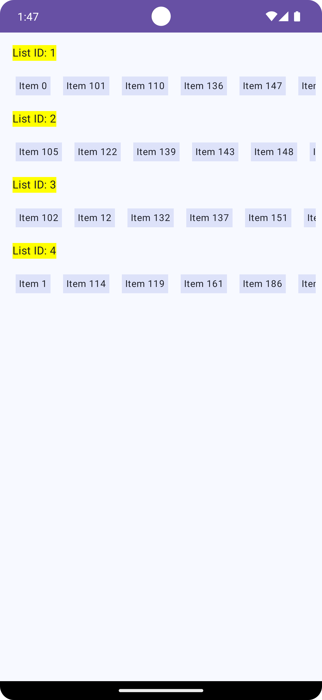

# ListApp

**ListApp** is an Android application that demonstrates modularized architecture, clean code practices, and dependency injection using **Koin**. The project is organized into multiple modules for better separation of concerns, reusability, and maintainability.

## Environment
- Android Studio Ladybug | 2024.2.1 Patch 2
- Gradle JDK: Azul Zulu 17.0.12
- App main screen


- Use cases recording


## Project Structure

The project is divided into the following modules:

- **app**
- **core**
- **listfetch**
    - **api**
    - **impl**

### Module Breakdown

#### `app` Module
The `app` module serves as touchpoint/host that uses `listfetch` feature, as well is the main application module.


#### `core` Module

The `core` module contains common utilities and base classes that are shared across different parts of the app. This module is designed to provide reusable components, helping avoid code duplication.

- **Purpose**: Holds base classes, utilities, and common functions.
- **Examples**: Utilities, common extensions, and shared resources.

#### `listfetch` Feature

The `listfetch` feature consists of two submodules: `api` and `impl`. This structure follows clean architecture principles, where the `api` module exposes the interface, and the `impl` module contains the actual implementation.

- **`listfetch:api` Module**:
    - **Purpose**: Defines the public-facing API for the `listfetch` feature, allowing other modules to interact with it.
    - **Access Control**: Only the DI (Dependency Injection) module and entry points are exposed to other modules, while the internal implementation remains hidden.
    - **Exposed Components**: Provides access to `ListFetchApi` for clients to obtain the feature’s primary composable function.

- **`listfetch:impl` Module**:
    - **Purpose**: Contains the actual implementation of the `listfetch` feature. This module is internal and not directly accessible by other modules.
    - **Structure**:
        - **`data`**: Handles data sources, repositories, and all data-related logic.
        - **`domain`**: Contains the core business logic of the feature, such as use cases and domain models.
        - **`di`**: Sets up the Koin DI module to manage dependencies within `listfetch`.
        - **`presenter`**: Manages UI logic and components for the `listfetch` feature.
    - **Accessibility**: The `impl` module is strictly internal. Other modules can only interact with `listfetch` through the `api` module.

### Accessing the `listfetch` Feature

The `ListFetchApi` interface in the `listfetch:api` module serves as the entry point to the feature. It provides access to the main composable function that hosts the `listfetch` feature's UI.

To integrate the `listfetch` feature in the host application, retrieve `ListfetchApi` from Koin and call `getListFetchComposableScreen()` to obtain the main composable.

Example usage:

```kotlin
// Accessing ListFetchApi through Koin
val fetchApi: ListFetchApi by inject()
val composableScreen = listfetchApi.getListFetchComposableScreen()
```

### Dependency Injection Setup

The project uses **Koin** for dependency injection. Each module defines its own DI configurations:

- The `core` module contains shared dependencies available across the app.
- The `listfetch:impl` module defines feature-specific dependencies and exposes only the necessary components through the `api` module.
- Koin is initialized and dependencies are loaded in `ListApplication` class, thus ensuring `ListFetchApi` can be injected whenever touchpoint has `listfetch:api` dependecy.


```kotlin
startKoin {
            androidContext(this@ListApplication)
            modules(
                dispatcherModule + retrofitModule +listFetchModule
            )
        }
```

## Unit Tests

The project includes unit tests to ensure the correctness of business logic within the `listfetch:impl` module.

### FilterItemsUseCaseTest

The `FilterItemsUseCaseTest` class in the `impl` module verifies that the business logic in the `FilterItemsUseCase` respects the following requirements:

- **Grouping**: Ensures that all items are displayed grouped by `listId`.
- **Sorting**: Verifies that items are sorted first by `listId` and then by `name`.
- **Filtering**: Filters out any items where `name` is blank or null.

These tests help maintain the integrity of the data handling and presentation logic, ensuring the feature behaves as expected.

## Summary

- **Core Module**: Provides common utilities and shared resources across modules.
- **Listfetch Feature**: Organized into two submodules (`api` and `impl`).
    - **`api`**: Exposes the feature’s entry points and DI configuration.
    - **`impl`**: Contains the feature's internal implementation, structured into `data`, `domain`, `di`, and `presenter`.
- **Access Point**: `ListfetchApi` in the `api` module provides the main composable function, enabling integration with the host app’s UI without exposing internal details.

This modular structure promotes clean architecture principles, makes the codebase more maintainable and scalable.
